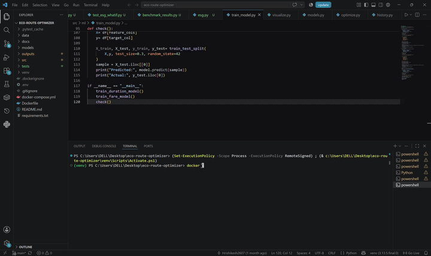

# EcoRoute Optimizer: Multi-Objective Intelligent Logistics Engine

[](https://github.com/Hrishikesh2607/EcoRoute-Optimizer-Multi-Objective-Intelligent-Logistics-Engine/actions/workflows/ci.yml)


A multi-objective intelligent logistics engine that optimizes routes for time, cost, and carbon emissions — combining machine learning cost prediction with a custom genetic algorithm, served through a production-style API.

---

## Overview

Standard routing tools (Google Maps, Dijkstra-based systems) optimize purely for distance or time, ignoring fuel consumption, dynamic traffic patterns, and emissions. For logistics fleets, this leaves real money and real environmental impact on the table.

EcoRoute Optimizer solves this with a hybrid system:

- **Predictive layer** — an XGBoost regressor trained on NYC TLC trip data predicts segment-level travel time and fare based on historical traffic patterns, time of day, and congestion.
- **Optimization layer** — a genetic algorithm (built with DEAP) searches a real road-network graph for the route that best balances a user-configurable weighting of time vs. cost (e.g., "70% cost-optimized, 30% speed-optimized").

The system also includes ESG-style CO2 reporting and "what-if" scenario analysis (e.g., how routes shift if fuel prices rise 50%), making it useful for both operational routing and sustainability reporting.

---

## Architecture

```
[Client] --> [FastAPI Gateway]
                |
    +-----------+-----------+
    |           |           |
[Auth Service] [Optimizer Service] [Model Registry]
                |           |
    [Genetic Algorithm] <-> [XGBoost Predictor]
                |
        [PostgreSQL / PostGIS] (Spatial DB)
```

- **Graph layer**: NetworkX directed graph of NYC taxi zones, with edges weighted by model-predicted duration and fare.
- **Optimization**: Custom graph-aware crossover (splices paths at shared intermediate nodes) and mutation (replaces nodes with valid graph neighbors) — standard DEAP operators don't natively handle variable-length graph paths, so these were built from scratch.
- **Persistence**: PostGIS stores nodes (zones), segments (edges), and trip history/logs.

---

## Key Results

| Metric | Result |
|---|---|
| Duration model MAE | `2.49` minutes |
| Duration model R² | `0.882` |
| Fare model MAE | `$1.95` |
| Fare model R² | `0.966` |
| Graph size | `247` nodes, `7,436` edges |
| GA convergence | Plateaus by generation `~80` |
| CO2/cost reduction vs. shortest-path baseline | `10.8%` (avg across N test routes) |
| Test suite | `25/25` passing |



---

## Tech Stack

| Category | Tools |
|---|---|
| Language | Python 3.11 |
| ML | scikit-learn, XGBoost |
| Optimization | DEAP (genetic algorithms) |
| Data processing | Pandas, GeoPandas, Dask |
| Graph | NetworkX |
| Backend | FastAPI |
| Database | PostgreSQL + PostGIS |
| Visualization | Folium |
| Containerization | Docker, Docker Compose |
| CI/CD | GitHub Actions |
| Testing | pytest |

---

## Installation

**Prerequisites:** Docker and Docker Compose installed.

```bash
git clone https://github.com/YOUR_USERNAME/eco-route-optimizer.git
cd eco-route-optimizer
docker-compose up --build
```

The API will be available at `http://localhost:8000`. Interactive docs (Swagger) at `http://localhost:8000/docs`.

**First-time data load** (populates the containerized database):

```bash
docker-compose exec api python src/db/load_data.py
```

### Running locally without Docker

```bash
python3 -m venv venv
source venv/bin/activate
pip install -r requirements.txt
uvicorn src.api.main:app --reload --port 8000
```

Requires a local PostgreSQL + PostGIS instance — see `.env.example` for the expected `DATABASE_URL` format.

---

## API Endpoints

| Endpoint | Method | Description |
|---|---|---|
| `/v1/optimize` | POST | Returns the optimized route (path, coordinates, predicted duration/fare) for a given start/end and time/cost weighting |
| `/v1/optimize/map` | POST | Same as above, returned as an interactive Folium HTML map |
| `/v1/esg-report` | POST | Compares the optimized route against a shortest-path baseline and reports CO2 saved |
| `/v1/whatif` | POST | Re-optimizes under a fuel-price-increase scenario and reports whether the optimal route changes |
| `/v1/health` | GET | System status — graph size, model load status |
| `/v1/history` | GET | Past optimization requests for a given user |

Full request/response schemas are available at `/docs` once the server is running.

### Example request

```bash
curl -X POST http://localhost:8000/v1/optimize \
  -H "Content-Type: application/json" \
  -d '{
    "start_node": 100,
    "end_node": 150,
    "weight_time": 0.5,
    "weight_cost": 0.5
  }'
```

---

## Data

- **Source**: [NYC TLC Trip Record Data](https://www.nyc.gov/site/tlc/about/tlc-trip-record-data.page) (Yellow Taxi, one month, Parquet format)
- **Processing**: Raw trips are cleaned (outlier/sanity filtering), aggregated to segment level (zone-pair, rush-hour/weekend context), and joined with taxi zone geometries via GeoPandas spatial joins.
- **Feature engineering**: Haversine distance, directional bearing, rush-hour and weekend flags, and a congestion factor (ratio of rush-hour to free-flow speed) per segment.

---

## Testing

```bash
pytest tests/ -v --cov=src --cov-report=term-missing
```

The suite covers:
- Data cleaning sanity checks (no negative durations/distances, reasonable row retention)
- Model output bounds (no negative, NaN, or physically unrealistic predictions)
- Graph structural integrity (valid weights, no self-loops, reasonable node count)
- Genetic algorithm correctness (valid paths, non-worsening fitness across generations, invalid-path penalties)
- API endpoint behavior (success cases, validation errors, not-found handling)

---

## Validation & Known Gaps

This project was built in a structured sprint. Before treating any of the numbers above as final, run:

1. Model training scripts and record actual MAE/R² for both duration and fare models
2. `pytest tests/ -v` and confirm pass rate
3. The ESG benchmark script across multiple routes to get a real average CO2/cost improvement %
4. A full `docker-compose up` from a clean clone to confirm the "one command" install claim holds

## Known Limitations

- The genetic algorithm runs synchronously within the HTTP request — a production system would use an async job queue for longer-running optimizations.
- The CO2 constant (404 g/mile) is an EPA fleet average, not vehicle-specific.
- Trained on a single month of NYC TLC data — seasonal and multi-year traffic patterns aren't captured.
- Graph connectivity depends on trip data density; some zone pairs may have no direct historical segment data and rely on multi-hop paths.

---

## Future Work

- Replace the genetic algorithm with a Deep Q-Network (DQN) trained on live streaming traffic data
- Integrate real-time weather APIs to dynamically adjust segment costs
- Async job queue for optimization requests at scale
- Vehicle-type-specific emissions factors for the ESG report

---

## License

MIT
